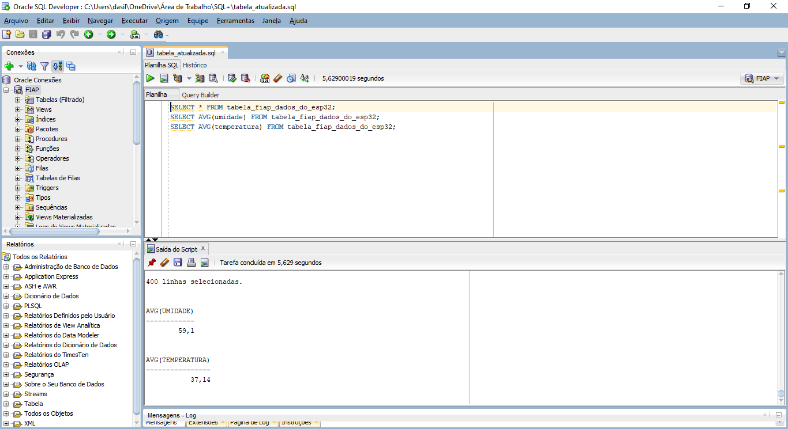

# Projeto FarmTech Solutions - Fase 3

<p align="center">
<a href="https://www.fiap.com.br/"></a>
</p>

## Integrantes
- Roberto Ferreira - RM561131

## Professores:
### Tutor(a) 
- Sabrina Otoni
### Coordenador(a)
- André Godoi

## Descrição  

Esse projeto abrange a importação dos dados obtidos pelos sensores na atividade do ESP32, na Fase 2 e sua importação para um banco de dados Oracle, além da documentação de todo o processo. 

Os dados são referentes aos sensores de umidade, pH, temperatura, irrigação e Nitrogênio, Fósforo e Potássio (NPK). O CSV contendo esses dados foi lido usando código Python e posteriormente inseridos na tabela Orcale `tabela_fiap_dados_do_esp32`.

Para validar a importação dos dados, analises básicas em SQL foram realizadas. Os prints presentes documentam essa realização.

## Estrutura de pastas
- **.github**: arquivos da configuração do GitHub  
- **assets**: logo e imagens gerais do projeto  
- **docs/prints**: prints das analises realizadas no banco Oracle  
- **dados**: CSV `dados_dos_sensores_fase2_esp32.csv`  
- **src**: scripts de Python (`import_csv_oracle.py`) e outros códigos fonte  

## Print do banco Oracle
Abaixo temos um print mostrando os dados inseridos com êxito no banco Oracle:




## Como executar o código
1. Possuir instalado **Python 3.12** ou superior instalado.
2. Instale as bibliotecas necessárias:
```bash
pip install pandas oracledb
